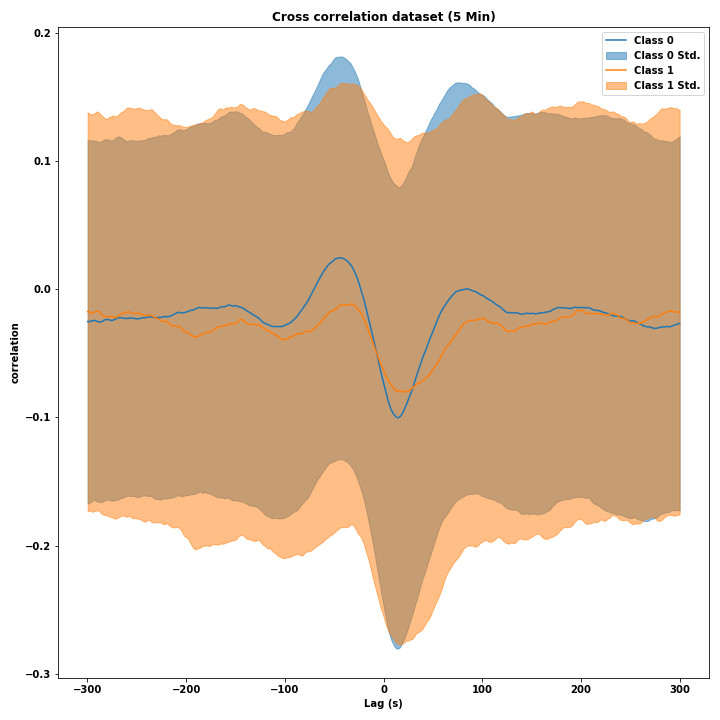
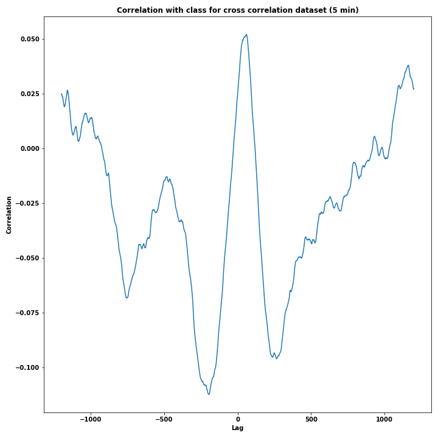
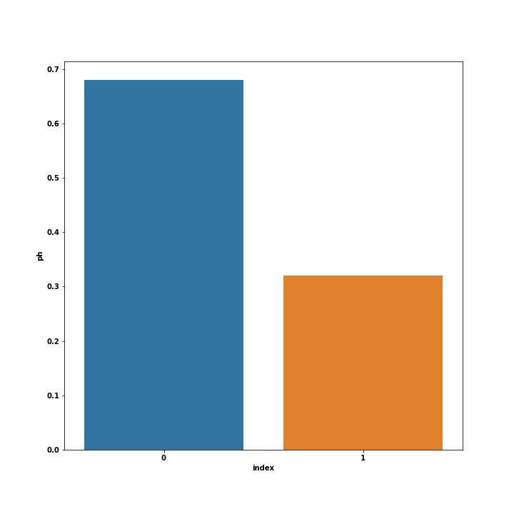

Partimos de unos datos de FHR y UC que consisten en 552 curvas con 21620 puntos (poco más de 90 minutos a 4Hz). Estos datos 
ya tienen marcadas a NaN los valores no válidos incluidos los tramos constantes.

Sobre estos datos calculamos la correlación cruzada con lag. Para ello desplazamos la UC un lag en el tiempo y
calculamos la correlación cruzada (NaN save pandas) con la FHR sin desplazar, variando el lag obtenemos la función de
correlación cruzada para cada curva que luego usaremos en el clasificador.

En este cálculo incluimos la limitación de que haya un mínimo de 3000 puntos distintos de NaN en cada correlación y 
descartamos las curvas que no cumplen esta condición en alguno de sus puntos.

Finalmente tenemos 536 curvas con 2399 puntos cada una, correspondientes a los lags positivos y negativos hasta 5 min. 

