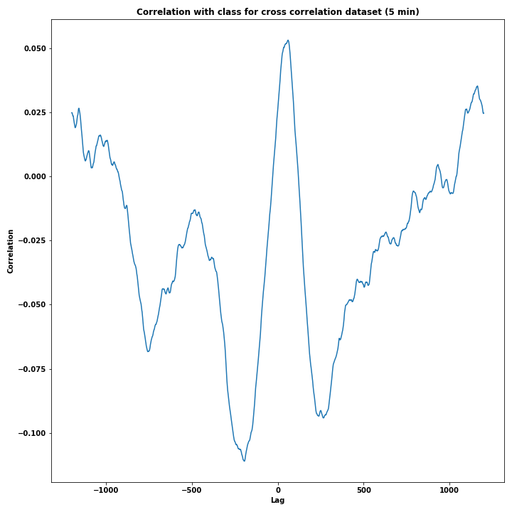

Partimos de unos datos de FHR y UC que consisten en 538 curvas con 21620 puntos (poco más de 90 minutos a 4Hz).

Primero para que las correlaciones cruzadas no se distorsionen mucho sustituimos las partes constantes muy largas (más de 5 minutos)
por NaN que no se tienen en cuenta para el cálculo.

Sobre estos datos calculamos la correlación cruzada con lag. Para ello desplazamos la UC un lag en el tiempo y
calculamos la correlación cruzada (NaN save pandas) con la FHR sin desplazar, variando el lag obtenemos la función de
correlación cruzada para cada curva que luego usaremos en el clasificador.

