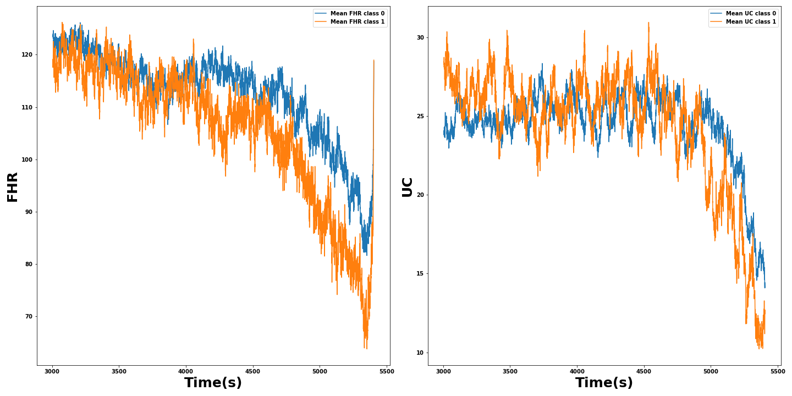

## Datos originales
Originalmente hay 552 patrones de longitud 21620 para la frecuencia fetal y las contracciones uterinas [(552, 21620)]

Sobre estos datos usamos el siguiente criterio para detectar curvas de UC que no van a tener la suficiente información
como para poder tener poder predictivo. Sumamos dos cantidades:

- La cantidad absoluta en número de puntos de la parte constante distinta de cero y  de  `np.nan`. Para este cálculo consideramos
solo las partes constantes con una duración superior a 5 segundos (20 puntos a 4Hz)
- La cantidad absoluta en número de puntos de ceros en la curva, independientemente de si son consecutivos.

Ordenamos las curvas respecto a este criterio y retiramos el 5% superior, lo que corresponde a 14 curvas (redondeando).
Las curvas eliminadas son [1104, 1119, 1130, 1134, 1149, 1155, 1158, 1186, 1188, 1258, 1327, 1376, 1451, 1477], siendo 6
de clase cero 8 de clase 1.

Después de esta primera limpieza tenemos 538 curvas con 21620 puntos cada una. Sobre las que además vamos a considerar 
no válidos, y los marcamos como NaN los valores "extremos", esto son menores o iguales a cero para ambas y mayores de 250 para la FHR.

Ahora vamos a quedarnos con los últimos 40 min de cada señal (9600 puntos con muestreo a 4Hz). Hay varios argumentos 
para justificar esta decision:

- Tenemos conocimiento experto que nos indica que la información más relevante contenida en las curvas se encuentra presente
en los momentos más cercanos al parto.
- Las señales están alineadas a la derecha (al momento del parto) y la UC más corta dura un poco más 41 minutos y la FHR 
más corta también un poco más de 41 minutos.
- Simplifica y acelera los cálculos al reducir a poco menos de la mitad.

Tras esta siguiente limpieza tenemos 538 de 9600 puntos cada una.

