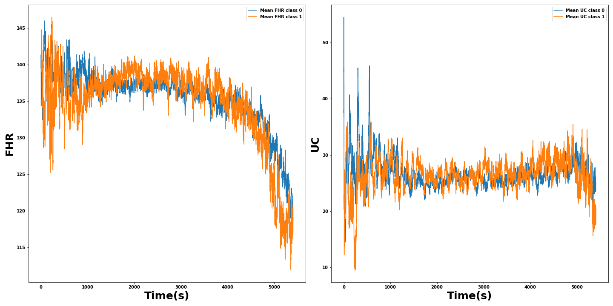

## Datos originales
Originalmente hay 552 patrones de longitud 21620 para la frecuencia fetal y las contracciones uterinas [(552, 21620)]

Lo siguiente que hacemos independiente del dataset a utilizar es marcar en los datos aquellos valores que no queremos considerar
coo válidos, estos son para la frecuencia cardiaca los que esten por encima de 250 y para los dos conjuntos los puntos en los que valga
cero o menos y los tramos en los que la curva permanezca constante durante más de 5 segundos (20 puntos a 4Hz.)

