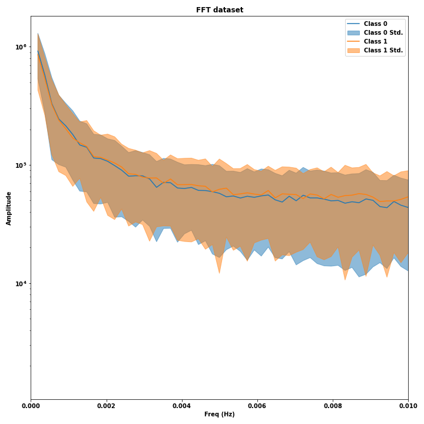
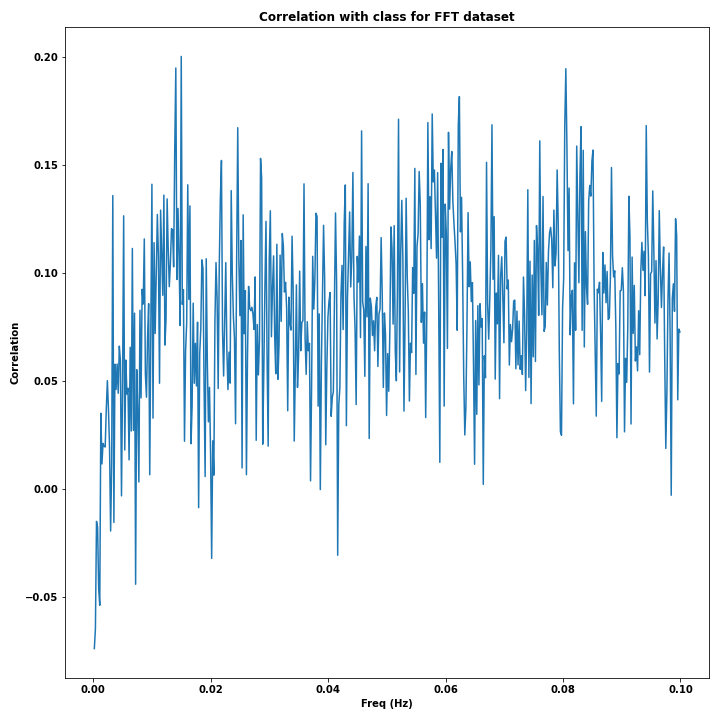

Partimos de unos datos de FHR que consisten en 552 curvas coon 21620 puntos (poco más de 90 minutos a 4Hz).

Primero eliminamos las curvas que habíamos descartado de los otros dos datasets basándonos en un mínimo de puntos válidos, 
esto nos reduce el número de curvas de 552 a 536.

Sobre estos datos vamos a calcular la DFT de cada curva, en el proceso perdemos resolución pues solo calculamos el valor
de la transformada de Fourier para las frecuencias menores del límite de Nyquist (2Hz). La implementación es NaN save
en el sentido de que los quita de la suma del cálculo y luego está ponderada por el número de puntos que no son nulos para 
tener magnitudes comparables. Por último la recortamos a frecuencias menores a 0.1Hz y quitamos el primer punto pues este no es más 
que la "parte no periódica" (media) de la curva. Por lo que finalmente tenemos 536 curvas de 540 puntos.  

