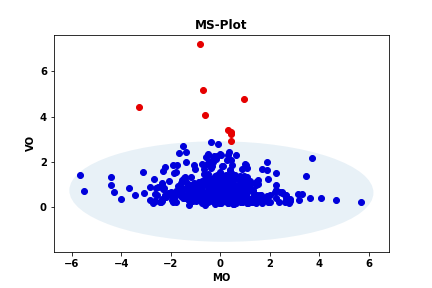

Vamos a explorar los outliers en cada conjunto de datos disponible utilizando 3 métodos de análisis funcional con ayuda
de la librería skfda:

- Outliergram
- Magnitude-shape plot 
- Basados en profundidad usando la Modified Band Depth y Integrated Depth

# Cross correlation dataset
### Outliergram
Vemos que hay unos cuantos outliers concretamente son [1007, 1009, 1010, 1027, 1035, 1055, 1081, 1169, 1197, 1198, 1312,
1345, 1388, 1409, 1418, 1482, 2024] (17), 11 de clase 0 y 6 de clase 1.

Se puden ver todos representados junto con la media global en la siguiente grafica.

### Magnitude-shape plot

Vemos que hay unos cuantos outliers concretamente son [1007, 1035, 1055, 1197, 1198, 1312, 1409, 1482, 2024] (9), 
5 de clase 0 y 4 de clase 1.

Se puden ver todos representados junto con la media global en la siguiente grafica.

Vemos que todos los detectados por este método ya habían sido detectados por el outliergram que habia detectado un conjunto 
mayor de curvas.

### Basados en profundidad

Vemos que este método no encuentra outliers para ninguna de las funciones de profundidad estudiadas.

