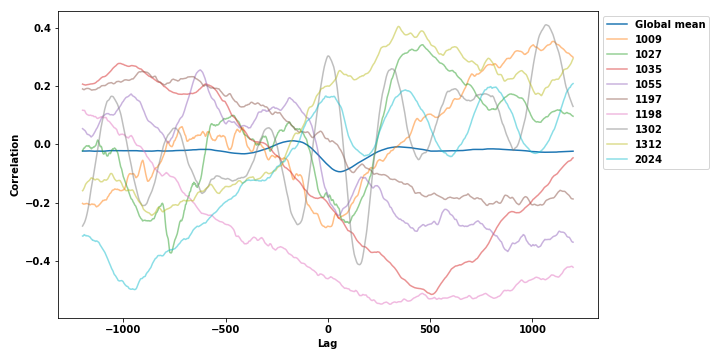
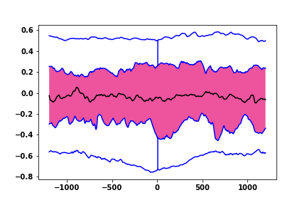
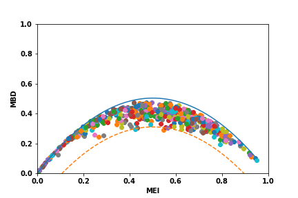
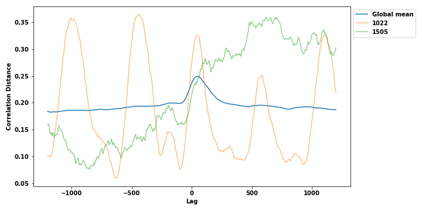
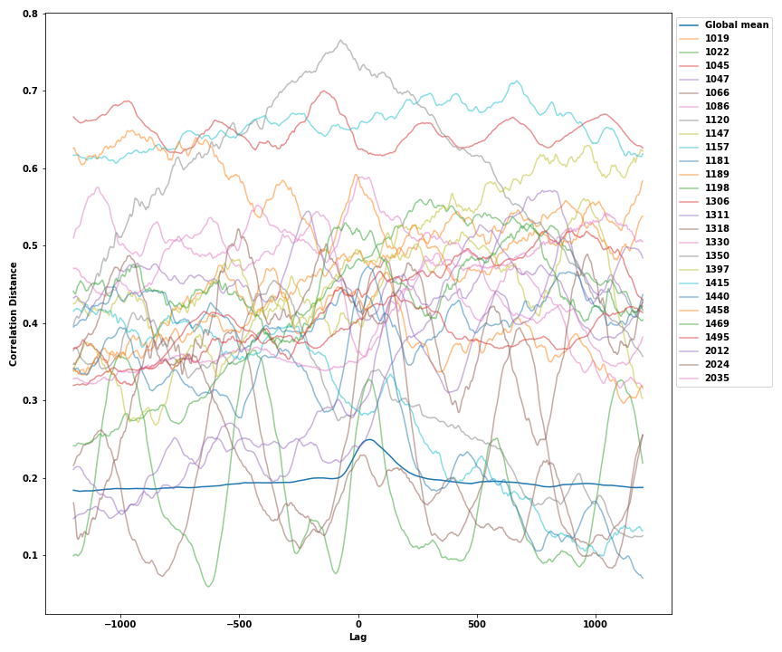

Vamos a explorar los outliers en cada conjunto de datos disponible utilizando 3 métodos de análisis funcional con ayuda
de la librería skfda:

- Outliergram
- Magnitude-shape plot 
- Basados en profundidad usando la Modified Band Depth y Integrated Depth

# Cross correlation dataset
### Outliergram
Vemos que hay unos cuantos outliers concretamente son [1007, 1009, 1010, 1027, 1035, 1055, 1081, 1169, 1197, 1198, 1312,
1345, 1388, 1409, 1418, 1482, 2024] (17), 11 de clase 0 y 6 de clase 1.

Se pueden ver todos representados junto con la media global en la siguiente gráfica.

### Magnitude-shape plot

Vemos que hay unos cuantos outliers concretamente son [1007, 1035, 1055, 1197, 1198, 1312, 1409, 1482, 2024] (9), 
5 de clase 0 y 4 de clase 1.

Se pueden ver todos representados junto con la media global en la siguiente gráfica.

Vemos que todos los detectados por este método ya habían sido detectados por el outliergram que había detectado un conjunto 
mayor de curvas.

### Basados en profundidad

Vemos que este método no encuentra outliers para ninguna de las funciones de profundidad estudiadas.

# Cross Distance correlation dataset
### Outliergram
Vemos que hay unos cuantos outliers concretamente son [1022, 1024, 1070, 1091, 1362, 1456, 1505] (7), 6 de clase 0 y 1 de clase 1.

Se pueden ver todos representados junto con la media global en la siguiente gráfica.

### Magnitude-shape plot

Vemos que hay unos cuantos outliers concretamente son [1019, 1022, 1035, 1045, 1086, 1091, 1100, 1120, 1126, 1150, 1151,
1157, 1191, 1198, 1199, 1219, 1266, 1311, 1350, 1391, 1397, 1415,
1440, 1456, 1458, 1469, 1482, 1505, 2012, 2024, 2035] (31),
22 de clase 0 y 9 de clase 1.

Se pueden ver todos representados junto con la media global en la siguiente gráfica.

En este caso vemos que los detectados por ambos métodos difieren.

### Basados en profundidad

En este caso los métodos basados en profundidad si encuentran outliers pero en menor medida coincidiendo los dos en dos de las curvas atípicas.

Para le Modified Band Depth

Se pueden ver todos representados junto con la media global en la siguiente gráfica.

Para la Integrated Depth

Se pueden ver todos representados junto con la media global en la siguiente gráfica.

